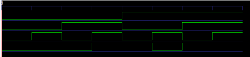

1. Truth Table
|a|b|sel|y|
|-|-|---|-|
|0|0| 0 |0|
|0|0| 1 |0|
|0|1| 0 |0|
|0|1| 1 |1|
|1|0| 0 |1|
|1|0| 1 |0|
|1|1| 0 |1|
|1|1| 1 |1|

2. a'bsel + ab'sel' + absel' + absel
misal c = sel
= (a'bc + abc)+(ab'c' +abc')
= bc + ac'
= bsel + asel'

so it is mean if (b and sel) or (a and (not sel))
if sel = 1 and b = 1 the answer y = 1

this is a answer from simulator
time=0     | a=0 b=0 sel=0 | y=0
time=10000 | a=0 b=0 sel=1 | y=0
time=20000 | a=0 b=1 sel=0 | y=0
time=30000 | a=0 b=1 sel=1 | y=1
time=40000 | a=1 b=0 sel=0 | y=1
time=50000 | a=1 b=0 sel=1 | y=0
time=60000 | a=1 b=1 sel=0 | y=1
time=70000 | a=1 b=1 sel=1 | y=1

this is simulation of the wave

