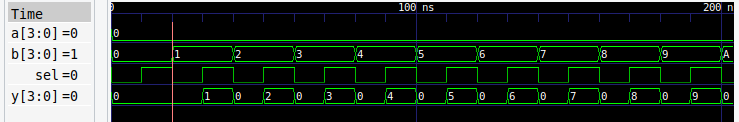

nested loop di testbench mirip bahasa c
for for (i = 0; i < 16; i = i + 1) begin
loopp
end
jadi ga perlu nulis 16x16x2 kemungkinan

hasil gtkwave

hasilnya 512 kemungkinan seperti ini
VCD info: dumpfile sim/mux.vcd opened for output.
time=10000 | a=0000 b=0000 sel=0 | y=0000
time=20000 | a=0000 b=0000 sel=1 | y=0000
time=30000 | a=0000 b=0001 sel=0 | y=0000
time=40000 | a=0000 b=0001 sel=1 | y=0001
time=50000 | a=0000 b=0010 sel=0 | y=0000
time=60000 | a=0000 b=0010 sel=1 | y=0010
time=70000 | a=0000 b=0011 sel=0 | y=0000
time=80000 | a=0000 b=0011 sel=1 | y=0011
time=90000 | a=0000 b=0100 sel=0 | y=0000
time=100000 | a=0000 b=0100 sel=1 | y=0100
time=110000 | a=0000 b=0101 sel=0 | y=0000
time=120000 | a=0000 b=0101 sel=1 | y=0101
time=130000 | a=0000 b=0110 sel=0 | y=0000
time=140000 | a=0000 b=0110 sel=1 | y=0110
time=150000 | a=0000 b=0111 sel=0 | y=0000
time=160000 | a=0000 b=0111 sel=1 | y=0111
time=170000 | a=0000 b=1000 sel=0 | y=0000
time=180000 | a=0000 b=1000 sel=1 | y=1000
time=190000 | a=0000 b=1001 sel=0 | y=0000
time=200000 | a=0000 b=1001 sel=1 | y=1001
time=210000 | a=0000 b=1010 sel=0 | y=0000
time=220000 | a=0000 b=1010 sel=1 | y=1010
time=230000 | a=0000 b=1011 sel=0 | y=0000
time=240000 | a=0000 b=1011 sel=1 | y=1011
time=250000 | a=0000 b=1100 sel=0 | y=0000
time=260000 | a=0000 b=1100 sel=1 | y=1100
time=270000 | a=0000 b=1101 sel=0 | y=0000
time=280000 | a=0000 b=1101 sel=1 | y=1101
time=290000 | a=0000 b=1110 sel=0 | y=0000
time=300000 | a=0000 b=1110 sel=1 | y=1110
time=310000 | a=0000 b=1111 sel=0 | y=0000
time=320000 | a=0000 b=1111 sel=1 | y=1111
time=330000 | a=0001 b=0000 sel=0 | y=0001
time=340000 | a=0001 b=0000 sel=1 | y=0000
time=350000 | a=0001 b=0001 sel=0 | y=0001
time=360000 | a=0001 b=0001 sel=1 | y=0001
time=370000 | a=0001 b=0010 sel=0 | y=0001
time=380000 | a=0001 b=0010 sel=1 | y=0010
time=390000 | a=0001 b=0011 sel=0 | y=0001
time=400000 | a=0001 b=0011 sel=1 | y=0011
time=410000 | a=0001 b=0100 sel=0 | y=0001
time=420000 | a=0001 b=0100 sel=1 | y=0100
time=430000 | a=0001 b=0101 sel=0 | y=0001
time=440000 | a=0001 b=0101 sel=1 | y=0101
time=450000 | a=0001 b=0110 sel=0 | y=0001
time=460000 | a=0001 b=0110 sel=1 | y=0110
time=470000 | a=0001 b=0111 sel=0 | y=0001
time=480000 | a=0001 b=0111 sel=1 | y=0111
time=490000 | a=0001 b=1000 sel=0 | y=0001
time=500000 | a=0001 b=1000 sel=1 | y=1000
time=510000 | a=0001 b=1001 sel=0 | y=0001
time=520000 | a=0001 b=1001 sel=1 | y=1001
time=530000 | a=0001 b=1010 sel=0 | y=0001
time=540000 | a=0001 b=1010 sel=1 | y=1010
time=550000 | a=0001 b=1011 sel=0 | y=0001
time=560000 | a=0001 b=1011 sel=1 | y=1011
time=570000 | a=0001 b=1100 sel=0 | y=0001
time=580000 | a=0001 b=1100 sel=1 | y=1100
time=590000 | a=0001 b=1101 sel=0 | y=0001
time=600000 | a=0001 b=1101 sel=1 | y=1101
time=610000 | a=0001 b=1110 sel=0 | y=0001
time=620000 | a=0001 b=1110 sel=1 | y=1110
time=630000 | a=0001 b=1111 sel=0 | y=0001
time=640000 | a=0001 b=1111 sel=1 | y=1111
time=650000 | a=0010 b=0000 sel=0 | y=0010
time=660000 | a=0010 b=0000 sel=1 | y=0000
time=670000 | a=0010 b=0001 sel=0 | y=0010
time=680000 | a=0010 b=0001 sel=1 | y=0001
time=690000 | a=0010 b=0010 sel=0 | y=0010
time=700000 | a=0010 b=0010 sel=1 | y=0010
time=710000 | a=0010 b=0011 sel=0 | y=0010
time=720000 | a=0010 b=0011 sel=1 | y=0011
time=730000 | a=0010 b=0100 sel=0 | y=0010
time=740000 | a=0010 b=0100 sel=1 | y=0100
time=750000 | a=0010 b=0101 sel=0 | y=0010
time=760000 | a=0010 b=0101 sel=1 | y=0101
time=770000 | a=0010 b=0110 sel=0 | y=0010
time=780000 | a=0010 b=0110 sel=1 | y=0110
time=790000 | a=0010 b=0111 sel=0 | y=0010
time=800000 | a=0010 b=0111 sel=1 | y=0111
time=810000 | a=0010 b=1000 sel=0 | y=0010
time=820000 | a=0010 b=1000 sel=1 | y=1000
time=830000 | a=0010 b=1001 sel=0 | y=0010
time=840000 | a=0010 b=1001 sel=1 | y=1001
time=850000 | a=0010 b=1010 sel=0 | y=0010
time=860000 | a=0010 b=1010 sel=1 | y=1010
time=870000 | a=0010 b=1011 sel=0 | y=0010
time=880000 | a=0010 b=1011 sel=1 | y=1011
time=890000 | a=0010 b=1100 sel=0 | y=0010
time=900000 | a=0010 b=1100 sel=1 | y=1100
time=910000 | a=0010 b=1101 sel=0 | y=0010
time=920000 | a=0010 b=1101 sel=1 | y=1101
time=930000 | a=0010 b=1110 sel=0 | y=0010
time=940000 | a=0010 b=1110 sel=1 | y=1110
time=950000 | a=0010 b=1111 sel=0 | y=0010
time=960000 | a=0010 b=1111 sel=1 | y=1111
time=970000 | a=0011 b=0000 sel=0 | y=0011
time=980000 | a=0011 b=0000 sel=1 | y=0000
time=990000 | a=0011 b=0001 sel=0 | y=0011
time=1000000 | a=0011 b=0001 sel=1 | y=0001
time=1010000 | a=0011 b=0010 sel=0 | y=0011
time=1020000 | a=0011 b=0010 sel=1 | y=0010
time=1030000 | a=0011 b=0011 sel=0 | y=0011
time=1040000 | a=0011 b=0011 sel=1 | y=0011
time=1050000 | a=0011 b=0100 sel=0 | y=0011
time=1060000 | a=0011 b=0100 sel=1 | y=0100
time=1070000 | a=0011 b=0101 sel=0 | y=0011
time=1080000 | a=0011 b=0101 sel=1 | y=0101
time=1090000 | a=0011 b=0110 sel=0 | y=0011
time=1100000 | a=0011 b=0110 sel=1 | y=0110
time=1110000 | a=0011 b=0111 sel=0 | y=0011
time=1120000 | a=0011 b=0111 sel=1 | y=0111
time=1130000 | a=0011 b=1000 sel=0 | y=0011
time=1140000 | a=0011 b=1000 sel=1 | y=1000
time=1150000 | a=0011 b=1001 sel=0 | y=0011
time=1160000 | a=0011 b=1001 sel=1 | y=1001
time=1170000 | a=0011 b=1010 sel=0 | y=0011
time=1180000 | a=0011 b=1010 sel=1 | y=1010
time=1190000 | a=0011 b=1011 sel=0 | y=0011
time=1200000 | a=0011 b=1011 sel=1 | y=1011
time=1210000 | a=0011 b=1100 sel=0 | y=0011
time=1220000 | a=0011 b=1100 sel=1 | y=1100
time=1230000 | a=0011 b=1101 sel=0 | y=0011
time=1240000 | a=0011 b=1101 sel=1 | y=1101
time=1250000 | a=0011 b=1110 sel=0 | y=0011
time=1260000 | a=0011 b=1110 sel=1 | y=1110
time=1270000 | a=0011 b=1111 sel=0 | y=0011
time=1280000 | a=0011 b=1111 sel=1 | y=1111
time=1290000 | a=0100 b=0000 sel=0 | y=0100
time=1300000 | a=0100 b=0000 sel=1 | y=0000
time=1310000 | a=0100 b=0001 sel=0 | y=0100
time=1320000 | a=0100 b=0001 sel=1 | y=0001
time=1330000 | a=0100 b=0010 sel=0 | y=0100
time=1340000 | a=0100 b=0010 sel=1 | y=0010
time=1350000 | a=0100 b=0011 sel=0 | y=0100
time=1360000 | a=0100 b=0011 sel=1 | y=0011
time=1370000 | a=0100 b=0100 sel=0 | y=0100
time=1380000 | a=0100 b=0100 sel=1 | y=0100
time=1390000 | a=0100 b=0101 sel=0 | y=0100
time=1400000 | a=0100 b=0101 sel=1 | y=0101
time=1410000 | a=0100 b=0110 sel=0 | y=0100
time=1420000 | a=0100 b=0110 sel=1 | y=0110
time=1430000 | a=0100 b=0111 sel=0 | y=0100
time=1440000 | a=0100 b=0111 sel=1 | y=0111
time=1450000 | a=0100 b=1000 sel=0 | y=0100
time=1460000 | a=0100 b=1000 sel=1 | y=1000
time=1470000 | a=0100 b=1001 sel=0 | y=0100
time=1480000 | a=0100 b=1001 sel=1 | y=1001
time=1490000 | a=0100 b=1010 sel=0 | y=0100
time=1500000 | a=0100 b=1010 sel=1 | y=1010
time=1510000 | a=0100 b=1011 sel=0 | y=0100
time=1520000 | a=0100 b=1011 sel=1 | y=1011
time=1530000 | a=0100 b=1100 sel=0 | y=0100
time=1540000 | a=0100 b=1100 sel=1 | y=1100
time=1550000 | a=0100 b=1101 sel=0 | y=0100
time=1560000 | a=0100 b=1101 sel=1 | y=1101
time=1570000 | a=0100 b=1110 sel=0 | y=0100
time=1580000 | a=0100 b=1110 sel=1 | y=1110
time=1590000 | a=0100 b=1111 sel=0 | y=0100
time=1600000 | a=0100 b=1111 sel=1 | y=1111
time=1610000 | a=0101 b=0000 sel=0 | y=0101
time=1620000 | a=0101 b=0000 sel=1 | y=0000
time=1630000 | a=0101 b=0001 sel=0 | y=0101
time=1640000 | a=0101 b=0001 sel=1 | y=0001
time=1650000 | a=0101 b=0010 sel=0 | y=0101
time=1660000 | a=0101 b=0010 sel=1 | y=0010
time=1670000 | a=0101 b=0011 sel=0 | y=0101
time=1680000 | a=0101 b=0011 sel=1 | y=0011
time=1690000 | a=0101 b=0100 sel=0 | y=0101
time=1700000 | a=0101 b=0100 sel=1 | y=0100
time=1710000 | a=0101 b=0101 sel=0 | y=0101
time=1720000 | a=0101 b=0101 sel=1 | y=0101
time=1730000 | a=0101 b=0110 sel=0 | y=0101
time=1740000 | a=0101 b=0110 sel=1 | y=0110
time=1750000 | a=0101 b=0111 sel=0 | y=0101
time=1760000 | a=0101 b=0111 sel=1 | y=0111
time=1770000 | a=0101 b=1000 sel=0 | y=0101
time=1780000 | a=0101 b=1000 sel=1 | y=1000
time=1790000 | a=0101 b=1001 sel=0 | y=0101
time=1800000 | a=0101 b=1001 sel=1 | y=1001
time=1810000 | a=0101 b=1010 sel=0 | y=0101
time=1820000 | a=0101 b=1010 sel=1 | y=1010
time=1830000 | a=0101 b=1011 sel=0 | y=0101
time=1840000 | a=0101 b=1011 sel=1 | y=1011
time=1850000 | a=0101 b=1100 sel=0 | y=0101
time=1860000 | a=0101 b=1100 sel=1 | y=1100
time=1870000 | a=0101 b=1101 sel=0 | y=0101
time=1880000 | a=0101 b=1101 sel=1 | y=1101
time=1890000 | a=0101 b=1110 sel=0 | y=0101
time=1900000 | a=0101 b=1110 sel=1 | y=1110
time=1910000 | a=0101 b=1111 sel=0 | y=0101
time=1920000 | a=0101 b=1111 sel=1 | y=1111
time=1930000 | a=0110 b=0000 sel=0 | y=0110
time=1940000 | a=0110 b=0000 sel=1 | y=0000
time=1950000 | a=0110 b=0001 sel=0 | y=0110
time=1960000 | a=0110 b=0001 sel=1 | y=0001
time=1970000 | a=0110 b=0010 sel=0 | y=0110
time=1980000 | a=0110 b=0010 sel=1 | y=0010
time=1990000 | a=0110 b=0011 sel=0 | y=0110
time=2000000 | a=0110 b=0011 sel=1 | y=0011
time=2010000 | a=0110 b=0100 sel=0 | y=0110
time=2020000 | a=0110 b=0100 sel=1 | y=0100
time=2030000 | a=0110 b=0101 sel=0 | y=0110
time=2040000 | a=0110 b=0101 sel=1 | y=0101
time=2050000 | a=0110 b=0110 sel=0 | y=0110
time=2060000 | a=0110 b=0110 sel=1 | y=0110
time=2070000 | a=0110 b=0111 sel=0 | y=0110
time=2080000 | a=0110 b=0111 sel=1 | y=0111
time=2090000 | a=0110 b=1000 sel=0 | y=0110
time=2100000 | a=0110 b=1000 sel=1 | y=1000
time=2110000 | a=0110 b=1001 sel=0 | y=0110
time=2120000 | a=0110 b=1001 sel=1 | y=1001
time=2130000 | a=0110 b=1010 sel=0 | y=0110
time=2140000 | a=0110 b=1010 sel=1 | y=1010
time=2150000 | a=0110 b=1011 sel=0 | y=0110
time=2160000 | a=0110 b=1011 sel=1 | y=1011
time=2170000 | a=0110 b=1100 sel=0 | y=0110
time=2180000 | a=0110 b=1100 sel=1 | y=1100
time=2190000 | a=0110 b=1101 sel=0 | y=0110
time=2200000 | a=0110 b=1101 sel=1 | y=1101
time=2210000 | a=0110 b=1110 sel=0 | y=0110
time=2220000 | a=0110 b=1110 sel=1 | y=1110
time=2230000 | a=0110 b=1111 sel=0 | y=0110
time=2240000 | a=0110 b=1111 sel=1 | y=1111
time=2250000 | a=0111 b=0000 sel=0 | y=0111
time=2260000 | a=0111 b=0000 sel=1 | y=0000
time=2270000 | a=0111 b=0001 sel=0 | y=0111
time=2280000 | a=0111 b=0001 sel=1 | y=0001
time=2290000 | a=0111 b=0010 sel=0 | y=0111
time=2300000 | a=0111 b=0010 sel=1 | y=0010
time=2310000 | a=0111 b=0011 sel=0 | y=0111
time=2320000 | a=0111 b=0011 sel=1 | y=0011
time=2330000 | a=0111 b=0100 sel=0 | y=0111
time=2340000 | a=0111 b=0100 sel=1 | y=0100
time=2350000 | a=0111 b=0101 sel=0 | y=0111
time=2360000 | a=0111 b=0101 sel=1 | y=0101
time=2370000 | a=0111 b=0110 sel=0 | y=0111
time=2380000 | a=0111 b=0110 sel=1 | y=0110
time=2390000 | a=0111 b=0111 sel=0 | y=0111
time=2400000 | a=0111 b=0111 sel=1 | y=0111
time=2410000 | a=0111 b=1000 sel=0 | y=0111
time=2420000 | a=0111 b=1000 sel=1 | y=1000
time=2430000 | a=0111 b=1001 sel=0 | y=0111
time=2440000 | a=0111 b=1001 sel=1 | y=1001
time=2450000 | a=0111 b=1010 sel=0 | y=0111
time=2460000 | a=0111 b=1010 sel=1 | y=1010
time=2470000 | a=0111 b=1011 sel=0 | y=0111
time=2480000 | a=0111 b=1011 sel=1 | y=1011
time=2490000 | a=0111 b=1100 sel=0 | y=0111
time=2500000 | a=0111 b=1100 sel=1 | y=1100
time=2510000 | a=0111 b=1101 sel=0 | y=0111
time=2520000 | a=0111 b=1101 sel=1 | y=1101
time=2530000 | a=0111 b=1110 sel=0 | y=0111
time=2540000 | a=0111 b=1110 sel=1 | y=1110
time=2550000 | a=0111 b=1111 sel=0 | y=0111
time=2560000 | a=0111 b=1111 sel=1 | y=1111
time=2570000 | a=1000 b=0000 sel=0 | y=1000
time=2580000 | a=1000 b=0000 sel=1 | y=0000
time=2590000 | a=1000 b=0001 sel=0 | y=1000
time=2600000 | a=1000 b=0001 sel=1 | y=0001
time=2610000 | a=1000 b=0010 sel=0 | y=1000
time=2620000 | a=1000 b=0010 sel=1 | y=0010
time=2630000 | a=1000 b=0011 sel=0 | y=1000
time=2640000 | a=1000 b=0011 sel=1 | y=0011
time=2650000 | a=1000 b=0100 sel=0 | y=1000
time=2660000 | a=1000 b=0100 sel=1 | y=0100
time=2670000 | a=1000 b=0101 sel=0 | y=1000
time=2680000 | a=1000 b=0101 sel=1 | y=0101
time=2690000 | a=1000 b=0110 sel=0 | y=1000
time=2700000 | a=1000 b=0110 sel=1 | y=0110
time=2710000 | a=1000 b=0111 sel=0 | y=1000
time=2720000 | a=1000 b=0111 sel=1 | y=0111
time=2730000 | a=1000 b=1000 sel=0 | y=1000
time=2740000 | a=1000 b=1000 sel=1 | y=1000
time=2750000 | a=1000 b=1001 sel=0 | y=1000
time=2760000 | a=1000 b=1001 sel=1 | y=1001
time=2770000 | a=1000 b=1010 sel=0 | y=1000
time=2780000 | a=1000 b=1010 sel=1 | y=1010
time=2790000 | a=1000 b=1011 sel=0 | y=1000
time=2800000 | a=1000 b=1011 sel=1 | y=1011
time=2810000 | a=1000 b=1100 sel=0 | y=1000
time=2820000 | a=1000 b=1100 sel=1 | y=1100
time=2830000 | a=1000 b=1101 sel=0 | y=1000
time=2840000 | a=1000 b=1101 sel=1 | y=1101
time=2850000 | a=1000 b=1110 sel=0 | y=1000
time=2860000 | a=1000 b=1110 sel=1 | y=1110
time=2870000 | a=1000 b=1111 sel=0 | y=1000
time=2880000 | a=1000 b=1111 sel=1 | y=1111
time=2890000 | a=1001 b=0000 sel=0 | y=1001
time=2900000 | a=1001 b=0000 sel=1 | y=0000
time=2910000 | a=1001 b=0001 sel=0 | y=1001
time=2920000 | a=1001 b=0001 sel=1 | y=0001
time=2930000 | a=1001 b=0010 sel=0 | y=1001
time=2940000 | a=1001 b=0010 sel=1 | y=0010
time=2950000 | a=1001 b=0011 sel=0 | y=1001
time=2960000 | a=1001 b=0011 sel=1 | y=0011
time=2970000 | a=1001 b=0100 sel=0 | y=1001
time=2980000 | a=1001 b=0100 sel=1 | y=0100
time=2990000 | a=1001 b=0101 sel=0 | y=1001
time=3000000 | a=1001 b=0101 sel=1 | y=0101
time=3010000 | a=1001 b=0110 sel=0 | y=1001
time=3020000 | a=1001 b=0110 sel=1 | y=0110
time=3030000 | a=1001 b=0111 sel=0 | y=1001
time=3040000 | a=1001 b=0111 sel=1 | y=0111
time=3050000 | a=1001 b=1000 sel=0 | y=1001
time=3060000 | a=1001 b=1000 sel=1 | y=1000
time=3070000 | a=1001 b=1001 sel=0 | y=1001
time=3080000 | a=1001 b=1001 sel=1 | y=1001
time=3090000 | a=1001 b=1010 sel=0 | y=1001
time=3100000 | a=1001 b=1010 sel=1 | y=1010
time=3110000 | a=1001 b=1011 sel=0 | y=1001
time=3120000 | a=1001 b=1011 sel=1 | y=1011
time=3130000 | a=1001 b=1100 sel=0 | y=1001
time=3140000 | a=1001 b=1100 sel=1 | y=1100
time=3150000 | a=1001 b=1101 sel=0 | y=1001
time=3160000 | a=1001 b=1101 sel=1 | y=1101
time=3170000 | a=1001 b=1110 sel=0 | y=1001
time=3180000 | a=1001 b=1110 sel=1 | y=1110
time=3190000 | a=1001 b=1111 sel=0 | y=1001
time=3200000 | a=1001 b=1111 sel=1 | y=1111
time=3210000 | a=1010 b=0000 sel=0 | y=1010
time=3220000 | a=1010 b=0000 sel=1 | y=0000
time=3230000 | a=1010 b=0001 sel=0 | y=1010
time=3240000 | a=1010 b=0001 sel=1 | y=0001
time=3250000 | a=1010 b=0010 sel=0 | y=1010
time=3260000 | a=1010 b=0010 sel=1 | y=0010
time=3270000 | a=1010 b=0011 sel=0 | y=1010
time=3280000 | a=1010 b=0011 sel=1 | y=0011
time=3290000 | a=1010 b=0100 sel=0 | y=1010
time=3300000 | a=1010 b=0100 sel=1 | y=0100
time=3310000 | a=1010 b=0101 sel=0 | y=1010
time=3320000 | a=1010 b=0101 sel=1 | y=0101
time=3330000 | a=1010 b=0110 sel=0 | y=1010
time=3340000 | a=1010 b=0110 sel=1 | y=0110
time=3350000 | a=1010 b=0111 sel=0 | y=1010
time=3360000 | a=1010 b=0111 sel=1 | y=0111
time=3370000 | a=1010 b=1000 sel=0 | y=1010
time=3380000 | a=1010 b=1000 sel=1 | y=1000
time=3390000 | a=1010 b=1001 sel=0 | y=1010
time=3400000 | a=1010 b=1001 sel=1 | y=1001
time=3410000 | a=1010 b=1010 sel=0 | y=1010
time=3420000 | a=1010 b=1010 sel=1 | y=1010
time=3430000 | a=1010 b=1011 sel=0 | y=1010
time=3440000 | a=1010 b=1011 sel=1 | y=1011
time=3450000 | a=1010 b=1100 sel=0 | y=1010
time=3460000 | a=1010 b=1100 sel=1 | y=1100
time=3470000 | a=1010 b=1101 sel=0 | y=1010
time=3480000 | a=1010 b=1101 sel=1 | y=1101
time=3490000 | a=1010 b=1110 sel=0 | y=1010
time=3500000 | a=1010 b=1110 sel=1 | y=1110
time=3510000 | a=1010 b=1111 sel=0 | y=1010
time=3520000 | a=1010 b=1111 sel=1 | y=1111
time=3530000 | a=1011 b=0000 sel=0 | y=1011
time=3540000 | a=1011 b=0000 sel=1 | y=0000
time=3550000 | a=1011 b=0001 sel=0 | y=1011
time=3560000 | a=1011 b=0001 sel=1 | y=0001
time=3570000 | a=1011 b=0010 sel=0 | y=1011
time=3580000 | a=1011 b=0010 sel=1 | y=0010
time=3590000 | a=1011 b=0011 sel=0 | y=1011
time=3600000 | a=1011 b=0011 sel=1 | y=0011
time=3610000 | a=1011 b=0100 sel=0 | y=1011
time=3620000 | a=1011 b=0100 sel=1 | y=0100
time=3630000 | a=1011 b=0101 sel=0 | y=1011
time=3640000 | a=1011 b=0101 sel=1 | y=0101
time=3650000 | a=1011 b=0110 sel=0 | y=1011
time=3660000 | a=1011 b=0110 sel=1 | y=0110
time=3670000 | a=1011 b=0111 sel=0 | y=1011
time=3680000 | a=1011 b=0111 sel=1 | y=0111
time=3690000 | a=1011 b=1000 sel=0 | y=1011
time=3700000 | a=1011 b=1000 sel=1 | y=1000
time=3710000 | a=1011 b=1001 sel=0 | y=1011
time=3720000 | a=1011 b=1001 sel=1 | y=1001
time=3730000 | a=1011 b=1010 sel=0 | y=1011
time=3740000 | a=1011 b=1010 sel=1 | y=1010
time=3750000 | a=1011 b=1011 sel=0 | y=1011
time=3760000 | a=1011 b=1011 sel=1 | y=1011
time=3770000 | a=1011 b=1100 sel=0 | y=1011
time=3780000 | a=1011 b=1100 sel=1 | y=1100
time=3790000 | a=1011 b=1101 sel=0 | y=1011
time=3800000 | a=1011 b=1101 sel=1 | y=1101
time=3810000 | a=1011 b=1110 sel=0 | y=1011
time=3820000 | a=1011 b=1110 sel=1 | y=1110
time=3830000 | a=1011 b=1111 sel=0 | y=1011
time=3840000 | a=1011 b=1111 sel=1 | y=1111
time=3850000 | a=1100 b=0000 sel=0 | y=1100
time=3860000 | a=1100 b=0000 sel=1 | y=0000
time=3870000 | a=1100 b=0001 sel=0 | y=1100
time=3880000 | a=1100 b=0001 sel=1 | y=0001
time=3890000 | a=1100 b=0010 sel=0 | y=1100
time=3900000 | a=1100 b=0010 sel=1 | y=0010
time=3910000 | a=1100 b=0011 sel=0 | y=1100
time=3920000 | a=1100 b=0011 sel=1 | y=0011
time=3930000 | a=1100 b=0100 sel=0 | y=1100
time=3940000 | a=1100 b=0100 sel=1 | y=0100
time=3950000 | a=1100 b=0101 sel=0 | y=1100
time=3960000 | a=1100 b=0101 sel=1 | y=0101
time=3970000 | a=1100 b=0110 sel=0 | y=1100
time=3980000 | a=1100 b=0110 sel=1 | y=0110
time=3990000 | a=1100 b=0111 sel=0 | y=1100
time=4000000 | a=1100 b=0111 sel=1 | y=0111
time=4010000 | a=1100 b=1000 sel=0 | y=1100
time=4020000 | a=1100 b=1000 sel=1 | y=1000
time=4030000 | a=1100 b=1001 sel=0 | y=1100
time=4040000 | a=1100 b=1001 sel=1 | y=1001
time=4050000 | a=1100 b=1010 sel=0 | y=1100
time=4060000 | a=1100 b=1010 sel=1 | y=1010
time=4070000 | a=1100 b=1011 sel=0 | y=1100
time=4080000 | a=1100 b=1011 sel=1 | y=1011
time=4090000 | a=1100 b=1100 sel=0 | y=1100
time=4100000 | a=1100 b=1100 sel=1 | y=1100
time=4110000 | a=1100 b=1101 sel=0 | y=1100
time=4120000 | a=1100 b=1101 sel=1 | y=1101
time=4130000 | a=1100 b=1110 sel=0 | y=1100
time=4140000 | a=1100 b=1110 sel=1 | y=1110
time=4150000 | a=1100 b=1111 sel=0 | y=1100
time=4160000 | a=1100 b=1111 sel=1 | y=1111
time=4170000 | a=1101 b=0000 sel=0 | y=1101
time=4180000 | a=1101 b=0000 sel=1 | y=0000
time=4190000 | a=1101 b=0001 sel=0 | y=1101
time=4200000 | a=1101 b=0001 sel=1 | y=0001
time=4210000 | a=1101 b=0010 sel=0 | y=1101
time=4220000 | a=1101 b=0010 sel=1 | y=0010
time=4230000 | a=1101 b=0011 sel=0 | y=1101
time=4240000 | a=1101 b=0011 sel=1 | y=0011
time=4250000 | a=1101 b=0100 sel=0 | y=1101
time=4260000 | a=1101 b=0100 sel=1 | y=0100
time=4270000 | a=1101 b=0101 sel=0 | y=1101
time=4280000 | a=1101 b=0101 sel=1 | y=0101
time=4290000 | a=1101 b=0110 sel=0 | y=1101
time=4300000 | a=1101 b=0110 sel=1 | y=0110
time=4310000 | a=1101 b=0111 sel=0 | y=1101
time=4320000 | a=1101 b=0111 sel=1 | y=0111
time=4330000 | a=1101 b=1000 sel=0 | y=1101
time=4340000 | a=1101 b=1000 sel=1 | y=1000
time=4350000 | a=1101 b=1001 sel=0 | y=1101
time=4360000 | a=1101 b=1001 sel=1 | y=1001
time=4370000 | a=1101 b=1010 sel=0 | y=1101
time=4380000 | a=1101 b=1010 sel=1 | y=1010
time=4390000 | a=1101 b=1011 sel=0 | y=1101
time=4400000 | a=1101 b=1011 sel=1 | y=1011
time=4410000 | a=1101 b=1100 sel=0 | y=1101
time=4420000 | a=1101 b=1100 sel=1 | y=1100
time=4430000 | a=1101 b=1101 sel=0 | y=1101
time=4440000 | a=1101 b=1101 sel=1 | y=1101
time=4450000 | a=1101 b=1110 sel=0 | y=1101
time=4460000 | a=1101 b=1110 sel=1 | y=1110
time=4470000 | a=1101 b=1111 sel=0 | y=1101
time=4480000 | a=1101 b=1111 sel=1 | y=1111
time=4490000 | a=1110 b=0000 sel=0 | y=1110
time=4500000 | a=1110 b=0000 sel=1 | y=0000
time=4510000 | a=1110 b=0001 sel=0 | y=1110
time=4520000 | a=1110 b=0001 sel=1 | y=0001
time=4530000 | a=1110 b=0010 sel=0 | y=1110
time=4540000 | a=1110 b=0010 sel=1 | y=0010
time=4550000 | a=1110 b=0011 sel=0 | y=1110
time=4560000 | a=1110 b=0011 sel=1 | y=0011
time=4570000 | a=1110 b=0100 sel=0 | y=1110
time=4580000 | a=1110 b=0100 sel=1 | y=0100
time=4590000 | a=1110 b=0101 sel=0 | y=1110
time=4600000 | a=1110 b=0101 sel=1 | y=0101
time=4610000 | a=1110 b=0110 sel=0 | y=1110
time=4620000 | a=1110 b=0110 sel=1 | y=0110
time=4630000 | a=1110 b=0111 sel=0 | y=1110
time=4640000 | a=1110 b=0111 sel=1 | y=0111
time=4650000 | a=1110 b=1000 sel=0 | y=1110
time=4660000 | a=1110 b=1000 sel=1 | y=1000
time=4670000 | a=1110 b=1001 sel=0 | y=1110
time=4680000 | a=1110 b=1001 sel=1 | y=1001
time=4690000 | a=1110 b=1010 sel=0 | y=1110
time=4700000 | a=1110 b=1010 sel=1 | y=1010
time=4710000 | a=1110 b=1011 sel=0 | y=1110
time=4720000 | a=1110 b=1011 sel=1 | y=1011
time=4730000 | a=1110 b=1100 sel=0 | y=1110
time=4740000 | a=1110 b=1100 sel=1 | y=1100
time=4750000 | a=1110 b=1101 sel=0 | y=1110
time=4760000 | a=1110 b=1101 sel=1 | y=1101
time=4770000 | a=1110 b=1110 sel=0 | y=1110
time=4780000 | a=1110 b=1110 sel=1 | y=1110
time=4790000 | a=1110 b=1111 sel=0 | y=1110
time=4800000 | a=1110 b=1111 sel=1 | y=1111
time=4810000 | a=1111 b=0000 sel=0 | y=1111
time=4820000 | a=1111 b=0000 sel=1 | y=0000
time=4830000 | a=1111 b=0001 sel=0 | y=1111
time=4840000 | a=1111 b=0001 sel=1 | y=0001
time=4850000 | a=1111 b=0010 sel=0 | y=1111
time=4860000 | a=1111 b=0010 sel=1 | y=0010
time=4870000 | a=1111 b=0011 sel=0 | y=1111
time=4880000 | a=1111 b=0011 sel=1 | y=0011
time=4890000 | a=1111 b=0100 sel=0 | y=1111
time=4900000 | a=1111 b=0100 sel=1 | y=0100
time=4910000 | a=1111 b=0101 sel=0 | y=1111
time=4920000 | a=1111 b=0101 sel=1 | y=0101
time=4930000 | a=1111 b=0110 sel=0 | y=1111
time=4940000 | a=1111 b=0110 sel=1 | y=0110
time=4950000 | a=1111 b=0111 sel=0 | y=1111
time=4960000 | a=1111 b=0111 sel=1 | y=0111
time=4970000 | a=1111 b=1000 sel=0 | y=1111
time=4980000 | a=1111 b=1000 sel=1 | y=1000
time=4990000 | a=1111 b=1001 sel=0 | y=1111
time=5000000 | a=1111 b=1001 sel=1 | y=1001
time=5010000 | a=1111 b=1010 sel=0 | y=1111
time=5020000 | a=1111 b=1010 sel=1 | y=1010
time=5030000 | a=1111 b=1011 sel=0 | y=1111
time=5040000 | a=1111 b=1011 sel=1 | y=1011
time=5050000 | a=1111 b=1100 sel=0 | y=1111
time=5060000 | a=1111 b=1100 sel=1 | y=1100
time=5070000 | a=1111 b=1101 sel=0 | y=1111
time=5080000 | a=1111 b=1101 sel=1 | y=1101
time=5090000 | a=1111 b=1110 sel=0 | y=1111
time=5100000 | a=1111 b=1110 sel=1 | y=1110
time=5110000 | a=1111 b=1111 sel=0 | y=1111
time=5120000 | a=1111 b=1111 sel=1 | y=1111
